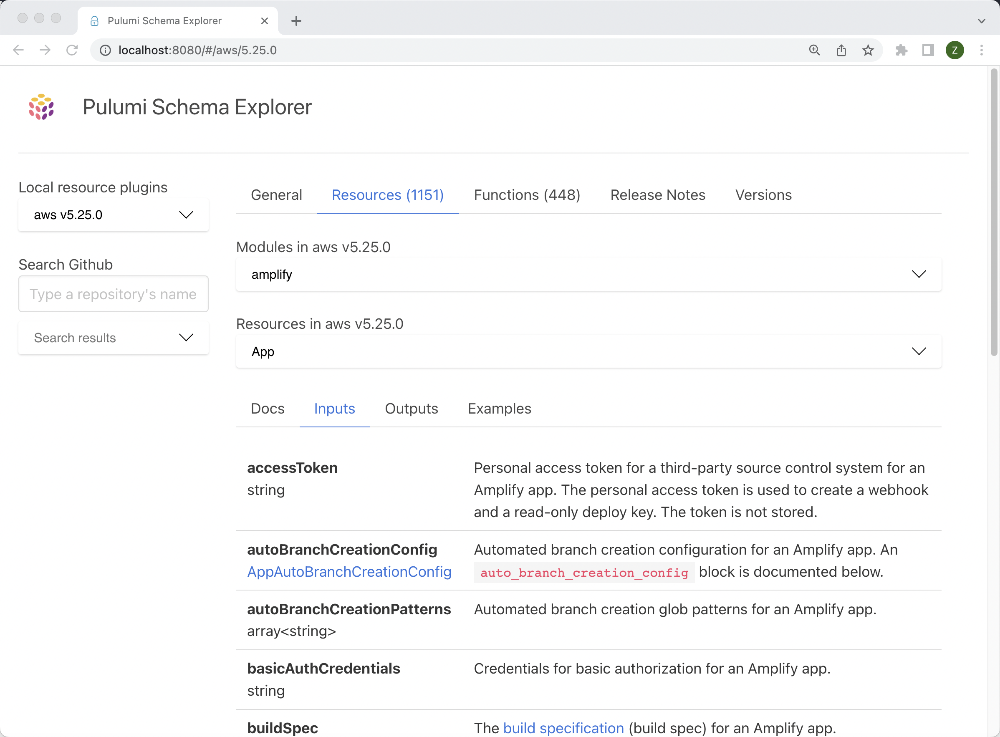
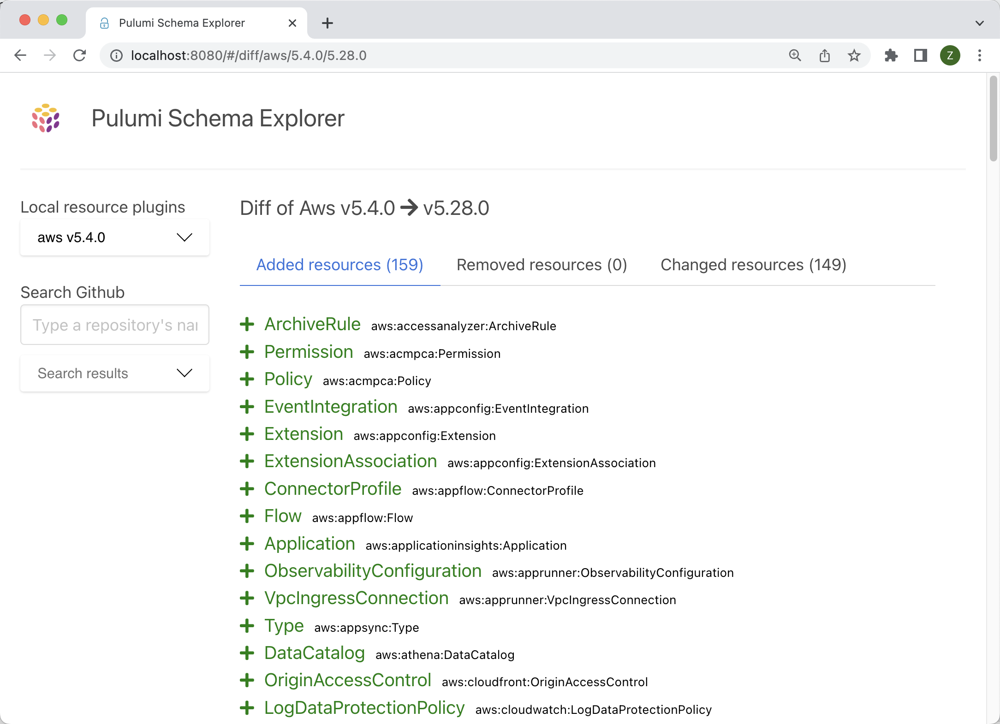
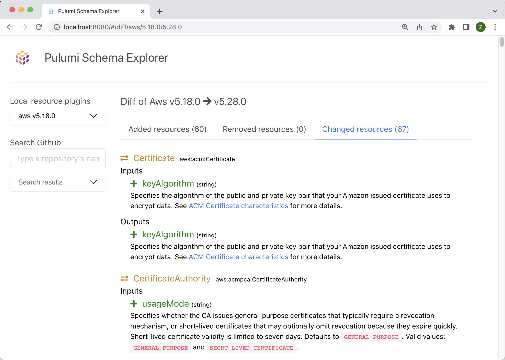

# Pulumi Schema Explorer [](https://www.nuget.org/packages/PulumiSchemaExplorer)

A Pulumi schema explorer built as a full stack web application in F# :heart:

See how this was built from scratch on this [YouTube playlist](https://www.youtube.com/watch?v=L9fx-03n9pc&list=PLBzGkJMamtz3R35a0QF8xFJNm75NF3s_s&ab_channel=ZaidAjaj) 

## Installtion & Usage
Built as dotnet CLI tool you can install:

```bash
dotnet tool install -g PulumiSchemaExplorer
```
once you have the tool installed, you can run as follows in your terminal:
```bash
pulumi-schema-explorer
```
and then navigate to `http://localhost:5000` which will show you the schema explorer

## Screenshots 

<details>
    <summary>Explore Resources and their properties, docs, etc.</summary>
    
</details>

<details>
    <summary>Diff two schemas and see added resources</summary>
    
</details>

<details>
    <summary>Diff exact property changes for two schemas</summary>
    
</details>

## Development

To run the project locally, you need to have the following installed:
 - Dotnet SDK v6.x
 - Nodejs v18.x or later
 - Pulumi CLI (preferably latest)

To run the project locally, you can run the following commands:
```bash
dotnet run
```

### Install the `pulumi-schema-explorer` tool locally
```bash
dotnet run LocalInstall
```
or to uninstall it
```bash
dotnet run LocalUninstall
```